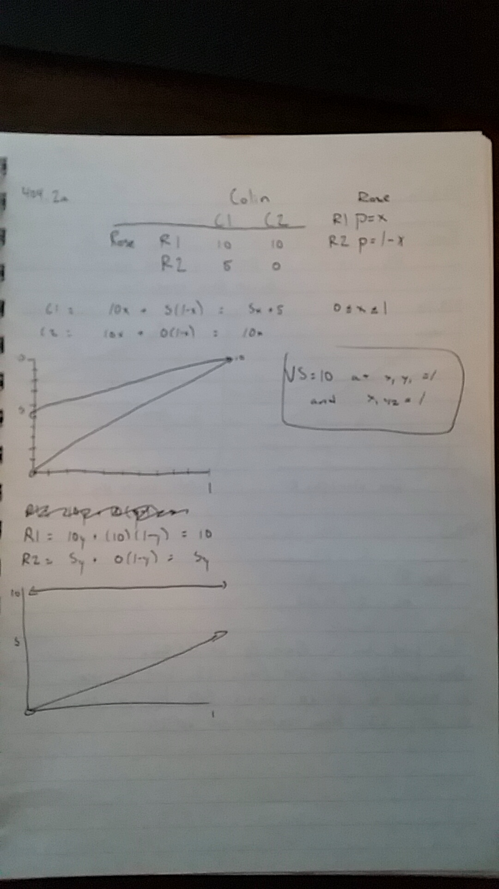
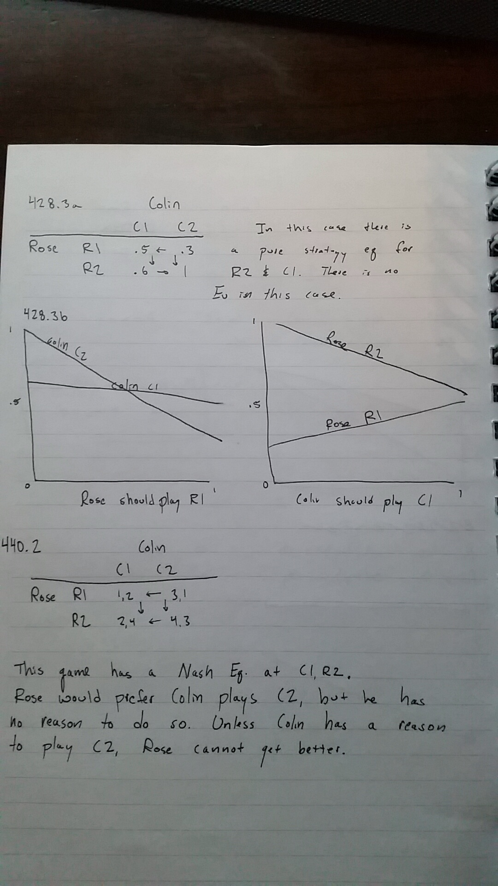
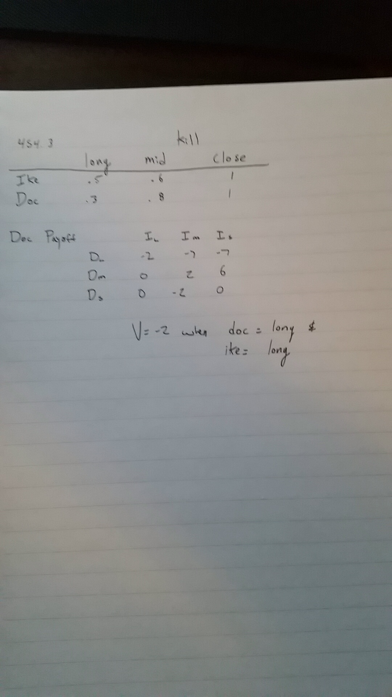

***

##385.1a

In either case, the row player ends with ev = 10. 

##385.1c

In this case the pitcher should throw a knuckle ball, and the batter should guess knuckleball. A fastball is detrimental to the pitcher's gains.

##404.2a

##420.1

The strategy is that Colin will play C2 and Rose will play R1. If this occurs then Rose will have 10 in either case, and Colin's choice becomes irrelevant. Since both outcomes are 10, there isn't a min-max.

##428.3 and 440.2

##454.3

